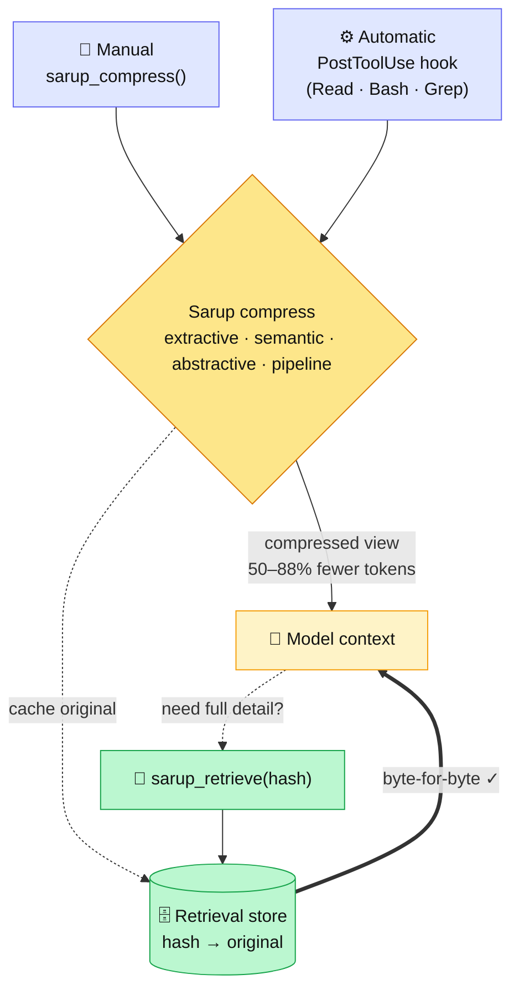

<div align="center">

# 🗜️ Sarup (สรุป)

**Thai-first context compression for Claude Code.**
Shrink the text you feed an LLM by **50–88%** — while the original stays **100% recoverable, byte-for-byte**.

[](https://www.python.org)
[](https://modelcontextprotocol.io)
[](tests/)
[](#install)
[](#license)

</div>

---

> *สรุป* means "to summarize." Headroom routes Thai through `noop` (0% savings) because its
> whitespace tokenizer can't find Thai word boundaries. Sarup uses PyThaiNLP segmentation, so it
> compresses Thai as well as English — and caches every original so nothing is ever lost.

## Contents

- [Highlights](#highlights)
- [Why it's safe — the two-tier guarantee](#why-its-safe--the-two-tier-guarantee)
- [How it works](#how-it-works)
- [Tools](#tools)
- [Compression modes](#compression-modes)
- [Measured results](#measured-results)
- [Install](#install)
- [Register with Claude Code](#register-with-claude-code)
- [Auto-compression hook](#auto-compression-hook)
- [Configuration](#configuration)
- [Project structure](#project-structure)
- [Tech stack & techniques](#tech-stack--techniques)
- [Testing](#testing)
- [Roadmap](#roadmap)
- [License](#license)

## Highlights

- 🇹🇭 **Real Thai compression** — PyThaiNLP `newmm` word segmentation, not whitespace.
- ♻️ **Lossless by guarantee** — every compress caches the original; `verified: true` proves a byte-for-byte round-trip.
- 🎚️ **Five modes** — from offline 1 ms TF-IDF to an 88%-savings cascade.
- 🧠 **Optional local LLM** — embeddings + rewrite via Ollama, with automatic offline fallback.
- ⚙️ **Auto mode** — a PostToolUse hook compresses large tool outputs with zero manual calls.
- 📏 **Honest metrics** — token counts from a real tokenizer (tiktoken), not byte guesses.
- 🔌 **Routing** — JSON compaction, log dedup, and verbatim code-fence preservation built in.

## Why it's safe — the two-tier guarantee

| Tier | What | Guarantee |
|------|------|-----------|
| **Compressed view** | the shrunk text the model works on | lossy · small · cheap |
| **Retrieval store** | the original, keyed by a stable hash | lossless · recoverable |

Aggressive lossy compression is safe *because* the original is always one `sarup_retrieve(hash)`
away. This is how "maximum savings" and "100% accuracy" coexist — they live in different tiers.

## How it works

Two entry points feed one engine: a cheap **compressed view** the model reads, and a lossless
**retrieval store** that can restore the original byte-for-byte.



- **Manual** — the model calls `sarup_compress` / `sarup_retrieve` itself.
- **Automatic** — the hook intercepts large tool outputs, caches the original to `SARUP_DB_PATH`,
  and substitutes the compressed view + a retrieval hash. Source code is skipped; small outputs
  pass through untouched.

## Tools

| Tool | Purpose |
|------|---------|
| `sarup_compress(content, target_ratio?, lossless?, query?, mode?)` | Compress; returns compressed text, hash, token metrics, `verified`, `token_method`. |
| `sarup_retrieve(hash)` | Recover the original content byte-for-byte. |
| `sarup_stats()` | Cumulative session savings. |

**`sarup_compress` arguments**

| Arg | Type | Default | Meaning |
|-----|------|---------|---------|
| `content` | string | — | Text to compress (required). |
| `target_ratio` | number | `0.5` | Fraction of prose to keep (0.1–0.9). |
| `lossless` | boolean | `false` | Only apply lossless transforms (whitespace / JSON compact). |
| `query` | string | `""` | Relevance hint — sentences matching it are kept. |
| `mode` | string | `extractive` | See modes below. |

## Compression modes

| Mode | How | Needs Ollama | Savings¹ | Speed¹ | Output |
|------|-----|:---:|:---:|:---:|--------|
| `extractive` *(default)* | TF-IDF scoring + n-gram dedup | no | 50.8% | ~1 ms | verbatim subset |
| `semantic` | Embedding centrality + cosine dedup | yes | 64.6% | ~1–2 s | verbatim subset |
| `abstractive` | Local-LLM rewrite | yes | ~51% | ~8–20 s | paraphrased |
| `pipeline` | Cascade: semantic → abstractive | yes | **88.1%** | ~2 s | paraphrased |
| `auto` | semantic if Ollama is up, else extractive | optional | 64.6% | ~90 ms | subset |

¹ Measured on a 10-sentence Thai paragraph (522 tokens). Every mode stays 100% recoverable via the
store; Ollama modes **degrade gracefully** to extractive when the backend is down.

## Measured results

```text
$ .\.venv\Scripts\python.exe bench\benchmark.py

sample                      before   after   savings   verify
Thai prose                     522     257    50.8%       OK
Thai prose (aggressive)        522     217    58.4%       OK
English prose                  105      54    48.6%       OK
JSON (lossless)                 67      44    34.3%       OK
Logs                           563     300    46.7%       OK
TOTAL                         1779     872    51.0%    ALL OK   → 100% recoverable

Mode comparison (Thai prose, 522 tok):
  extractive 50.8% (1ms) · auto 64.6% (~90ms) · semantic 64.6% (2.1s)
  abstractive 51.1% (8s) · pipeline 88.1% (2.3s)        ← all verified recoverable
```

Token counts via tiktoken `cl100k_base` — a real tokenizer, not a byte heuristic.

## Install

```powershell
py -3.11 -m venv .venv
.\.venv\Scripts\python.exe -m pip install -e ".[dev]"
```

Optional local-LLM modes (`semantic` / `abstractive` / `pipeline`) need [Ollama](https://ollama.com):

```powershell
ollama pull nomic-embed-text     # embeddings → semantic mode
ollama pull gemma3:12b           # rewrite → abstractive / pipeline (Thai-validated)
```

## Register with Claude Code

Add to your MCP config (e.g. `.mcp.json` or `~/.claude.json`):

```json
{
  "mcpServers": {
    "sarup": {
      "command": "d:\\WORK\\Sarup\\.venv\\Scripts\\python.exe",
      "args": ["-m", "sarup.server"],
      "env": { "SARUP_DB_PATH": "d:\\WORK\\Sarup\\.sarup-cache.db" }
    }
  }
}
```

Or run it directly over stdio:

```powershell
.\.venv\Scripts\python.exe -m sarup.server
```

## Auto-compression hook

Skip manual tool calls entirely: install the **PostToolUse hook** and large `Read`/`Bash`/`Grep`
outputs are compressed before they enter context, with the original cached for retrieval.
Source-code reads are skipped for safety. Full setup in **[hooks/README.md](hooks/README.md)**.

```json
{
  "hooks": {
    "PostToolUse": [
      { "matcher": "Read|Bash|Grep",
        "hooks": [{ "type": "command",
          "command": "d:\\WORK\\Sarup\\.venv\\Scripts\\python.exe d:\\WORK\\Sarup\\hooks\\sarup_hook.py" }] }
    ]
  },
  "env": { "SARUP_DB_PATH": "d:\\WORK\\Sarup\\.sarup-cache.db" }
}
```

## Configuration

| Var | Default | Meaning |
|-----|---------|---------|
| `SARUP_DB_PATH` | *(in-memory)* | SQLite path for a persistent, cross-process store. **Required** for hook retrieval. |
| `OLLAMA_HOST` | `http://localhost:11434` | Ollama endpoint. |
| `SARUP_ABSTRACTIVE_MODEL` | `gemma3:12b` | Model for abstractive / pipeline rewrite. |
| `SARUP_EMBED_MODEL` | `nomic-embed-text` | Model for semantic embeddings. |
| `SARUP_HOOK_MODE` | `auto` | Hook compression mode. |
| `SARUP_HOOK_MIN_CHARS` | `4000` | Hook only compresses outputs larger than this. |

## Project structure

```text
sarup/
├── src/sarup/
│   ├── server.py       # MCP stdio server — 3 tools
│   ├── compressor.py   # router + modes (extractive/semantic/abstractive/pipeline/auto)
│   ├── thai.py         # PyThaiNLP tokenization, sentence split, TF-IDF
│   ├── semantic.py     # embedding centrality + cosine dedup
│   ├── llm.py          # optional Ollama backend (generate + embed)
│   ├── tokens.py       # real token counting (tiktoken)
│   └── store.py        # CCR store: hash → original (memory + SQLite)
├── hooks/
│   ├── sarup_hook.py   # PostToolUse auto-compression hook
│   └── README.md       # hook install guide
├── bench/benchmark.py  # before/after measurement
├── tests/              # 50 tests (test_thai, test_mcp, test_hook)
├── README.md
└── STACK.md            # full stack + techniques
```

## Tech stack & techniques

Python 3.11 · MCP · PyThaiNLP `newmm` · tiktoken · Ollama (optional) · SQLite · hatchling · pytest.

The technique behind each mode — TF-IDF scoring, embedding centrality, cascade pipeline, content
routing, and graceful degradation — is documented in **[STACK.md](STACK.md)**.

## Testing

```powershell
.\.venv\Scripts\python.exe -m pytest tests/ -q
```

50 tests cover Thai NLP, the MCP tool contracts, every mode (including Ollama-fallback paths), the
roundtrip-verify guarantee, and the auto-compression hook (incl. cross-process retrieval).

## Roadmap

- [ ] Make `auto` the default mode for `sarup_compress` (currently `extractive`).
- [ ] Optional Typhoon 2.1 abstractive (blocked on an Ollama template fix).
- [ ] Per-content adaptive `target_ratio`.
- [ ] Published PyPI package.

## License

MIT
