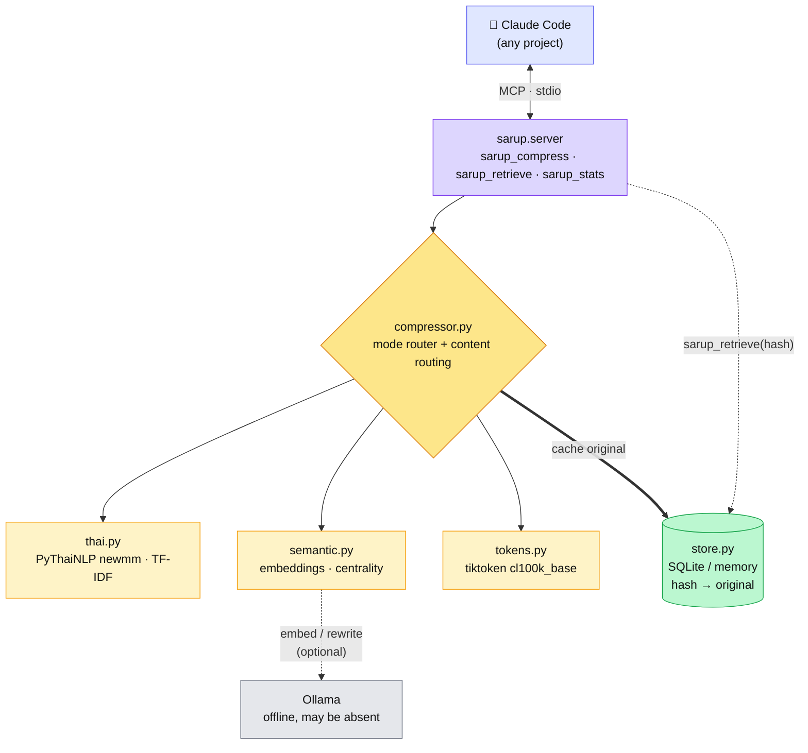
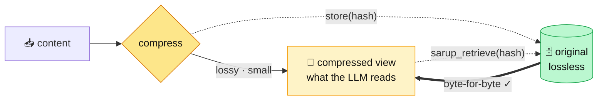

# Stack & Techniques

What Sarup is built from, and the technique behind each part.

## Tech stack

| Layer | Choice | Why |
|-------|--------|-----|
| Language | Python 3.11+ | PyThaiNLP ecosystem; MCP SDK |
| Protocol | [MCP](https://modelcontextprotocol.io) (`mcp>=1.9`, stdio) | Native Claude Code tool integration |
| Thai NLP | [PyThaiNLP](https://pythainlp.org) `newmm` | Word segmentation — Thai has no spaces between words |
| Token counting | [tiktoken](https://github.com/openai/tiktoken) `cl100k_base` | Real tokenizer (offline) → verifiable savings, not byte guesses |
| Local LLM (optional) | [Ollama](https://ollama.com) via stdlib `urllib` | Embeddings + abstractive rewrite, fully offline, no extra dep |
| Embeddings | `nomic-embed-text` | Semantic sentence scoring & dedup |
| Abstractive model | `gemma3:12b` (default) | SCB10X-validated Thai base; configurable |
| Storage | in-memory dict + optional SQLite | CCR (compress-and-cache-retrieval) original store |
| Hash | SHA-256, first 24 hex chars | Deterministic, stable content key |
| Build | hatchling | Simple PEP 621 packaging |
| Tests | pytest + pytest-asyncio | all modes incl. Ollama-fallback paths |

## System architecture

How the pieces fit — Sarup is a plain MCP stdio server, so it plugs into Claude Code as
tools and never sits in the API request path:

If the server or Ollama is unavailable, Claude Code is unaffected — the tools simply
go away (server) or compression falls back to the offline path (Ollama).

## Core architecture: two-tier guarantee

The single idea that makes "max savings + 100% accuracy" possible:

Lossy compression is *safe* because the original is always one hash lookup away.
Every compress call runs `store.verify(hash, original)` and reports
`verified: true` — the guarantee is proven per call, not assumed.

## Techniques per compression mode

### 1. Extractive (default, offline, deterministic)
- **Word tokenization** via PyThaiNLP `newmm` (Thai) / whitespace (English).
- **TF-IDF sentence scoring** — rank sentences by term importance.
- **Query boost** (×2.5) — sentences matching an optional `query` score higher.
- **Position bias** — first/last sentences kept (framing).
- **n-gram (2-gram) Jaccard dedup** — drop near-duplicate sentences.
- Output is a **verbatim subset** of input sentences (no paraphrase).

### 2. Semantic (Ollama, best ratio)
- **Sentence embeddings** (`nomic-embed-text`).
- **Centrality scoring** — each sentence ranked by mean cosine similarity to all
  others (most representative kept).
- **Cosine dedup** — catches paraphrased repetition that n-grams miss.
- Output is still a **verbatim subset** — ranks by *meaning*, not word overlap.

### 3. Abstractive (Ollama, slow)
- **Local-LLM rewrite** with a strict "preserve all facts, add nothing" prompt
  (Thai or English variant chosen by content).
- `<think>` blocks from reasoning models are stripped.
- Accepted only if it genuinely reduces tokens; otherwise falls back.

### 4. Pipeline (Ollama, maximum savings)
- **Cascade**: stage 1 selects the most representative sentences (semantic, or
  TF-IDF if embeddings are down); stage 2 abstractively rewrites the survivors.
- Each stage feeds the next → ~88% on Thai prose (522→62 tokens measured).
- Lossy view, but still fully recoverable: the original is cached before any
  stage runs.

### auto
- Prefers **semantic** when Ollama is up (best ratio for the speed), else
  **extractive** offline. The sensible everyday default for the hook.

### Content routing (before mode applies)
| Detected | Handling | Lossless? |
|----------|----------|:---:|
| JSON | compact (strip insignificant whitespace) | ✅ |
| Logs | dedup repeated lines + head-truncate | ❌ |
| Prose + code fences | compress prose, **preserve code verbatim** | code: ✅ |
| Pure prose | selected mode | subset / paraphrase |

## Graceful degradation
`abstractive → semantic → extractive`. If Ollama is down or a model is missing,
Sarup silently falls back to the deterministic offline path. It always works
offline; Ollama only raises the ceiling.

## Notes from model evaluation (June 2026)
- **Typhoon 2.1** (SCB10X, Thai-tuned) is the strongest Thai base in principle,
  but its current GGUF chat template crashes `llama-server` in recent Ollama
  (`unknown test 'tool_calls'`) — unusable until repackaged.
- **Qwen3** tends to "overthink" (slower, conservative compression) — matches
  SCB10X's own published observation.
- **Gemma 3 12B** is the validated balance for Thai → chosen default (gemma4
  variants compressed *less* — 30–36% vs gemma3's 51% — in our bakeoff).
- For everyday use, **semantic mode beats abstractive**: higher ratio, ~4× faster,
  and verbatim (safer). For maximum reduction, **pipeline** cascades both (~88%).
